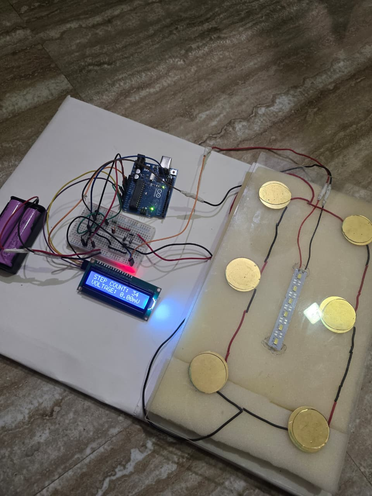

# Footstep Power Generation System

A renewable energy harvesting project that converts mechanical energy from human footsteps into electrical power using piezoelectric sensors.

---

## Overview
This project demonstrates the generation of electrical energy from footsteps using piezoelectric sensors. The generated energy is rectified, regulated, and monitored using an Arduino microcontroller and displayed on an LCD.

---

## Components Used
- Piezoelectric sensors
- Arduino Uno
- Bridge rectifier
- Capacitors
- Voltage regulator
- 16x2 LCD
- LEDs
- Rechargeable battery
- Breadboard and jumper wires

---

## Working Principle
1. Pressure from footsteps activates piezoelectric sensors  
2. Sensors generate AC voltage  
3. Voltage is converted to DC using a rectifier  
4. Energy is regulated and stored  
5. Output voltage and step count are displayed on LCD  

---

## Project Setup

---

## Results
- Successfully generated voltage from footsteps
- Real-time step count displayed
- LED powered using harvested energy
- Demonstrates feasibility of renewable energy harvesting

---

## Applications
- Smart walkways
- Railway stations
- Public infrastructure
- Educational demonstrations

---

## Author
Swarup Jadhav  
Automation & Robotics Engineering Student

## Project Setup

### Prototype View

### Final Setup

### Working Demo Video
[Click here to watch the working demo](images/setup_working.mp4)
